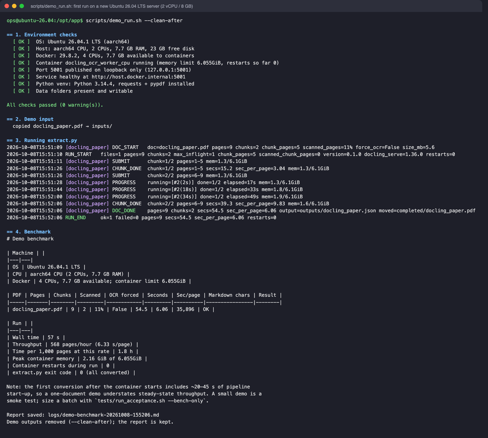

# docling-batch-extract

[](https://github.com/saibal-roy/docling-batch-extract/actions/workflows/ci.yml) [](LICENSE) [](https://github.com/saibal-roy/docling-batch-extract/releases)

**Batch PDF → Markdown extraction on a single CPU-only server, using [docling-serve](https://github.com/docling-project/docling-serve).**

Converts every PDF dropped into `inputs/` to Markdown. Each result is saved as JSON in `outputs/`. Successfully converted PDFs move to `completed/` and failed ones to `errors/`. Each PDF gets its own log in `logs/`. It's validated on a **2 vCPU / 8 GB** server running **Ubuntu 26.04 LTS**, CPU only, with no GPU, and needs no cloud API.

License: [MIT](LICENSE) · Author: **Saibal Roy** ([website](https://www.saibalroy.com/) · [LinkedIn](https://www.linkedin.com/in/roysaibal) · [GitHub](https://github.com/saibal-roy)) · Documentation site: [saibal-roy.github.io/docling-batch-extract](https://saibal-roy.github.io/docling-batch-extract/)

## Background

This was built for document-heavy work in **legal tech and claims insurance**. Legal and claims documents (petitions, affidavits, court records, claim forms, assessment reports, many of them scanned) had to be turned into Markdown to feed a **RAG (retrieval-augmented generation) search** system. Cloud services such as AWS Textract or vision-LLM APIs were too expensive for the pilot of **about 500 documents averaging 47 pages (~23,500 pages)**. These documents are also confidential, so keeping them on your own server is a benefit in itself.

The requirements were:
- **Cost:** a single small CPU-only VM, run in batches.
- **Unattended operation:** a corrupt or awkward PDF must never stop the batch, and every document leaves an audit trail.
- **Scanned documents:** many legal and claims records are scans whose embedded text layer is poor.

**Why it's open source:** it started as a production requirement, not a demo. It's published as a reusable business solution that other teams with the same problem can deploy on one small server and trust. The reasoning ships with the code: the cost model, the benchmarks behind every default, the acceptance checks and the go-ahead gate.

The [Pilot batch estimate](#pilot-batch-estimate-500-documents--47-pages) section below compares the costs. [`versions/`](versions/) records how the design changed as real documents exposed problems. [`prompts.md`](prompts.md) has prompts to rebuild, run and extend the solution with Claude.

## Contents

- [How it works](#how-it-works)
- [Developer machine setup](#developer-machine-setup-macos--windows--linux-desktop)
- [Server setup](#server-setup-linux)
- [Usage and options](#usage-and-options)
- [Logs and monitoring](#logs-and-monitoring)
- [Server specification and capacity](#server-specification-and-capacity) (including the [pilot batch estimate and cost comparison](#pilot-batch-estimate-500-documents--47-pages))
- [Docker image: size and download time](#docker-image-size-and-download-time)
- [Troubleshooting](#troubleshooting)
- [Publishing the documentation site (GitHub Pages)](#publishing-the-documentation-site-github-pages)
- [Maintenance policy: CPU only, latest LTS / stable, pinned](#maintenance-policy-cpu-only-latest-lts--stable-pinned-upgraded-through-the-gate)
- [Versioning and releases](#versioning-and-releases)
- [Test results](#test-results)
- [How this was built (timeline and story)](STORY.md) · [Prompts for building and maintaining this with Claude](prompts.md) · [Design history](versions/) · [Landing page plan](versions/landing-page-plan-v2.md)

---

## How it works

```
inputs/*.pdf ──► extract.py ──► docling-serve container (127.0.0.1:5001, 1 worker × 2 threads on 2 vCPU)
                   │
                   ├─ success ──► outputs/<name>.json  +  PDF moved to completed/
                   ├─ PDF error ─► PDF moved to errors/  (reason in logs/<name>.log)
                   └─ every PDF ─► logs/<name>.log
```

1. **Inspect.** `extract.py` reads each PDF's page count and checks whether it is a **scan**: at least half its pages are full-page images.
2. **Plan.**
   - **Text PDFs** are split into 5-page ranges, which convert in parallel.
   - **Scanned PDFs** are sent as one job with **OCR forced**. The text layer that scanners embed is often garbled; docling's own OCR is cleaner and faster. Splitting a scan makes two OCR jobs compete for memory, which was slower in testing.
3. **Convert.** As many jobs run at once as the container has workers: **1 on the 2 vCPU target** (1 worker × 2 threads), read automatically from the container. A background check reads the container's memory every 5 s and **pauses new submissions above 75 %** of the limit, so the container doesn't run out of memory.
4. **Recover.** If the container restarts (for example after running out of memory), lost jobs are resent automatically, up to 2 times each.
5. **Finish.**
   - When all of a PDF's ranges are done, the Markdown is joined in page order and written to `outputs/<name>.json`. Only then is the PDF moved to `completed/`.
   - If a PDF fails (it's corrupt, docling rejects it, or it fails after retries), it's moved to `errors/` and the other PDFs continue.
   - If the **server itself** goes down and doesn't recover, the run stops and the unfinished PDFs **stay in `inputs/`**. A server outage never moves good files to `errors/`.

Running the script again only processes what is still in `inputs/`.

### Folder layout

```
docker-compose.yml   docling-serve container (CPU image, 6.5 GB limit)
extract.py           the script
requirements.txt     requests, pypdf
inputs/               put PDFs here
outputs/             <name>.json per converted PDF
completed/           PDFs that converted successfully
errors/              PDFs that failed
logs/                <name>.log per PDF (replaced each time that PDF is processed)
                     (each data folder has its own .gitignore: the folder is in git, its contents never are)
scripts/             setup_ubuntu.sh (server setup) · demo_run.sh (first run + benchmark) · cleanup.sh
scripts/demo-files/  public demo PDF (CC BY 4.0) with its license note
.github/workflows/   ci.yml (lint, data guard, setup + acceptance on Ubuntu 26.04 LTS) · pages.yml · release.yml
ruff.toml            Python lint rules used locally and in CI
versions/            plan history (plan-v1 … plan-v5): requirements, decisions, evidence
tests/               acceptance tests and benchmarks (see "Test results")
prompts.md           prompts to rebuild, operate and extend the solution with Claude
STORY.md             how it was built: timeline, lessons, go-ahead validation
LICENSE              MIT
SECURITY.md          how to report a vulnerability privately
CHANGELOG.md         releases and the versioning policy (semantic versioning)
```

### Output format (`outputs/<name>.json`)

```json
{
  "source_file": "report.pdf",
  "status": "success",
  "pages": 37,
  "chunks": 1,
  "force_ocr": true,
  "extractor_version": "0.1.0",
  "engine": {"pdf_backend": "pypdfium2", "docling_serve": "1.30.0", "docling": "2.118.0"},
  "markdown": "## Section 1 ...",
  "processing_time": 133.0,
  "errors": [],
  "converted_at": "2026-10-08T11:45:00Z"
}
```

---

## Developer machine setup (macOS / Windows / Linux desktop)

**Prerequisites**
- Docker Desktop with **at least 8 GB of memory and 2 CPUs** given to its VM (Settings → Resources). The container is capped at 6.5 GB, and the VM needs some headroom on top.
- Python 3.10 or later.
- About 6 GB of free disk space for the image.

```bash
git clone https://github.com/saibal-roy/docling-batch-extract.git
cd docling-batch-extract

# 1. Start the service (first run downloads ~2.2 GB; see "Docker image" below)
docker compose up -d
curl http://localhost:5001/health          # → {"status":"ok"}

# 2. Python environment
python3 -m venv .venv
.venv/bin/pip install -r requirements.txt

# 3. Convert
mkdir -p inputs && cp ~/Downloads/*.pdf inputs/
.venv/bin/python extract.py

# 4. Watch one document while it runs
tail -f logs/<name>.log
```

The container keeps running between runs (`restart: always`). Stop it with `docker compose down` when you don't need it.

API docs for the running service: http://localhost:5001/docs

---

## Server setup (Linux)

Supported: **Ubuntu 26.04 LTS** (the latest LTS; only this release is supported and tested) on a **2 vCPU / 8 GB** server. **No GPU or CUDA is needed.** The image is published for both amd64 and arm64.

### Quick setup on Ubuntu (recommended)

```bash
git clone https://github.com/saibal-roy/docling-batch-extract.git /opt/textextract
cd /opt/textextract
scripts/setup_ubuntu.sh                 # or: --cron-minutes 10 · --no-cron
```

Run it as the user that will own the service, not as root. It uses `sudo` where needed. The script:
1. Checks the OS, CPUs, RAM and disk, and warns if they're below the recommended spec.
2. Installs Docker Engine and the compose plugin from Docker's official apt repository, plus Python venv and `flock`.
3. Adds you to the `docker` group, creates `.venv` and the data folders.
4. Pulls and starts the container and waits for `/health`.
5. Installs the cron entry.

It's safe to run again. Log out and back in afterwards so the `docker` group membership applies.

**Then run the first demo** to confirm the machine works and see how fast it is:

```bash
scripts/demo_run.sh                 # or --clean-after to remove the demo's outputs afterwards
```

It checks the environment, stopping on any failure:
- OS, CPUs, RAM and disk
- the Docker daemon and the CPUs and memory it can use
- the container and its memory limit
- `/health`
- the Python venv and packages
- the data folders (`inputs/` must not already hold PDFs)

Then it copies the public demo PDF from [`scripts/demo-files/`](scripts/demo-files/) (the *Docling Technical Report*, 9 pages, CC BY 4.0) into `inputs/` and runs the real `extract.py`. It prints a **benchmark for this machine** and saves it as `logs/demo-benchmark-<time>.md`. The benchmark shows pages, chunks, OCR, seconds per page, pages per hour, peak container memory and restarts.

On the simulated 2 vCPU / 8 GB server (Ubuntu 26.04 LTS) the demo took **54.5 s (6.06 s/page)**, with a 2.2 GiB memory peak. The demo PDF is mostly text, which docling v1.36.0 converts more slowly than scans; a one-document run also includes start-up.



*Real output of `scripts/demo_run.sh --clean-after` in a fresh Ubuntu 26.04 LTS container pinned to 2 CPUs, during the go-ahead validation (regenerate with `docs/render_demo_screenshot.py`).*

The manual steps below do the same thing, for other distributions or for running each step yourself.

### 1. Install

```bash
# Docker Engine + compose plugin (https://docs.docker.com/engine/install/)
sudo apt-get install -y docker.io docker-compose-v2 python3-venv
sudo usermod -aG docker $USER          # the script reads `docker stats`; log out and back in

sudo mkdir -p /opt/textextract && sudo chown $USER /opt/textextract
git clone https://github.com/saibal-roy/docling-batch-extract.git /opt/textextract
cd /opt/textextract
python3 -m venv .venv && .venv/bin/pip install -r requirements.txt
mkdir -p inputs outputs completed errors logs
```

### 2. Start the service (and keep it running)

```bash
docker compose up -d                   # restart: always → comes back after reboots and crashes
docker compose ps
curl -s localhost:5001/health
```

On Linux the 6.5 GB limit applies directly (there's no VM in between), so the host needs about **8 GB of RAM**.

### 3. Run the extractor on a schedule

The script processes whatever is in `inputs/` and then exits. Run it from cron, and use `flock` so runs never overlap:

```cron
# crontab -e : check inputs/ every 5 minutes
*/5 * * * * cd /opt/textextract && flock -n /tmp/textextract.lock .venv/bin/python extract.py >/dev/null 2>&1
```

Each PDF's details are in `logs/<name>.log`. To keep the run summaries (`RUN_START`/`RUN_END`), redirect the console output to a file instead of `/dev/null`.

How files arrive in `inputs/` is up to you: SFTP, an rsync job, a mounted share, and so on. To be safe, upload to a temporary name such as `file.pdf.part` and rename it to `.pdf` once the upload completes. The script only picks up `*.pdf`.

### 4. Operate

| Task | Command |
|------|---------|
| Service status | `docker compose ps` · `curl localhost:5001/health` |
| Container memory | `docker stats --no-stream docling_ocr_worker_cpu` |
| Crash / OOM restarts | `docker inspect -f '{{.RestartCount}}' docling_ocr_worker_cpu` |
| Failed PDFs | `ls errors/` and the matching `logs/<name>.log` |
| Retry a failed PDF | `mv errors/x.pdf inputs/` |
| Update docling | change the image tag in `docker-compose.yml` → `docker compose pull && docker compose up -d` |
| Clean up artifacts | `scripts/cleanup.sh` (see below) |

### Cleaning up

`scripts/cleanup.sh` lists what it will remove and asks for confirmation. By default it empties `outputs/`, `completed/`, `errors/` and `logs/`. The folders and their `.gitignore` files stay, so the next run works straight away and git still sees the folders. and removes `tests/work/`. It **keeps `inputs/`**, which holds PDFs not yet processed, and the saved test results.

```bash
scripts/cleanup.sh --dry-run        # show what would be removed
scripts/cleanup.sh                  # default clean, asks first
scripts/cleanup.sh --inputs          # also empty inputs/
scripts/cleanup.sh --results        # also remove tests/results/
scripts/cleanup.sh --docker         # also stop and remove the container
scripts/cleanup.sh --all -y         # everything: + inputs/, results, .venv, container and image (~5 GB)
```

Copy anything you need out of `outputs/` before cleaning. The JSON files are the product of the batch.

---

## Usage and options

```bash
.venv/bin/python extract.py [options]
```

| Option | Default | Meaning |
|--------|---------|---------|
| `--input` / `--output` / `--completed` / `--errors` / `--logs` | `inputs` / `outputs` / `completed` / `errors` / `logs` | Folders |
| `--url` | `http://localhost:5001` | docling-serve address |
| `--max-inflight` | the container's worker count (1 on the 2 vCPU target) | Jobs running at once. Read from the container's `DOCLING_SERVE_ENG_LOC_NUM_WORKERS`; more only queues on the server |
| `--chunk-pages` | `5` | Page-range size for text PDFs (`0` = never split) |
| `--scanned-chunk-pages` | `0` | Page-range size for scanned PDFs (`0` = whole document) |
| `--ocr` | `auto` | `auto` forces OCR on scanned PDFs · `force` forces it on all PDFs · `default` uses docling's own choice |
| `--pdf-backend` | `pypdfium2` | PDF reader used by docling (see [Troubleshooting](#troubleshooting)) |
| `--mem-high` | `0.75` | Pause new jobs above this fraction of the container's memory limit |
| `--container` | `docling_ocr_worker_cpu` | Container name used for memory and restart checks |
| `--retries` | `2` | Resends per job after a container restart |
| `--heartbeat` | `30` | Seconds between `PROGRESS` lines |
| `--timeout` | `60` | Seconds allowed **per page** of a job (minimum 10 min per job) |

`extract.py --version` prints the version (see [Versioning and releases](#versioning-and-releases)).

**Exit codes:** `0` all succeeded · `1` some PDFs moved to `errors/` · `2` docling-serve unreachable or down (unfinished PDFs stay in `inputs/`).

---

## Logs and monitoring

Every PDF gets its own `logs/<name>.log`, containing only that file's events. It's **replaced** each time that PDF is processed. The console shows the same lines tagged with the file name, plus run-level lines (`RUN_START`, `THROTTLE`, `RUN_END`).

```
2026-10-08T17:17:34 DOC_START   doc=medium.pdf pages=15 chunks=3 chunk_pages=5 scanned_pages=0% force_ocr=False size_mb=0.0
2026-10-08T17:20:57 SUBMIT      chunk=1/3 pages=1-5 mem=4.1/6.3GiB
2026-10-08T17:21:09 CHUNK_DONE  chunk=1/3 pages=1-5 secs=12.0 sec_per_page=2.40 mem=4.0/6.3GiB
2026-10-08T17:21:27 PROGRESS    running=[#3(14s)] done=2/3 elapsed=30s mem=4.2/6.3GiB
2026-10-08T17:21:57 DOC_DONE    pages=15 chunks=3 secs=36.5 sec_per_page=2.43 output=outputs/medium.json moved=completed/medium.pdf
```

| Line | Meaning |
|------|---------|
| `DOC_START` | Page count, number of ranges, whether it's a scan, and whether OCR is forced |
| `SUBMIT` | A page range was sent to docling, with container memory at that moment |
| `PROGRESS` | Every 30 s while the PDF is converting: running ranges with elapsed time, done/total |
| `CHUNK_DONE` | Time taken for one range |
| `DOC_DONE` | **Total time, pages, seconds per page**, output file, where the PDF was moved |
| `DOC_FAILED` | Reason, and where the PDF was moved (`errors/`) |
| `RETRY` | A range was resent after a container restart |
| `ABORTED` | The server went down; the PDF was left in `inputs/` |

---

## Server specification and capacity

### Recommended server: 2 vCPU / 8 GB (the validated target)

| | Validated target | Notes |
|---|---|---|
| CPU | **2 vCPU** (x86-64 or ARM64) | docling runs **1 worker × 2 threads** (written to `.env` by `scripts/setup_ubuntu.sh`) |
| RAM | **8 GB** | 6.5 GB container limit + about 1.5 GB for the OS and `extract.py` |
| GPU | **None** | CPU-only image |
| Disk | **20 GB** | 4.8 GB image + PDFs + outputs |
| OS | **Ubuntu 26.04 LTS** (the only supported release) | `setup_ubuntu.sh` refuses others unless `--force` |

**Larger machines** are sized automatically by `setup_ubuntu.sh` (workers = vCPUs ÷ 2, 2 threads each, memory = RAM − 1.5 GB), but **only 2 vCPU / 8 GB is validated**. Measure a larger size with `tests/profile_benchmark.sh` before relying on it.

### Deploying on AWS EC2

For products already built on AWS, EC2 is the natural place to run this, on CPU-based instances with no GPU. For the 2 vCPU / 8 GB target:

| Instance | vCPU / RAM | On-demand price (us-east-1, Linux) | When to use |
|----------|-----------|-------------------------------------|-------------|
| **`m7i.large`** (recommended for batches) | 2 / 8 GiB | $0.1008/h (~$73.58/month if left running) | Production batches such as the pilot. Not burstable: full speed for the whole batch |
| `t3.large` | 2 / 8 GiB | $0.0832/h (~$60.74/month) | Small or occasional batches. **Burstable:** baseline is 30 % of each vCPU. A long batch either slows to that baseline once CPU credits run out, or, with *T3 Unlimited*, is billed $0.05 per vCPU-hour extra, which comes to **~$0.153/h at full load: more than `m7i.large`** |
| `c6i.xlarge` / `c6i.2xlarge` | 4 / 8 · 8 / 16 GiB | ~$124.10 · ~$248.20 /month | Larger volumes or tighter deadlines. Auto-sized by setup, **not validated** |

Prices: [m7i.large](https://calculator.holori.com/aws/ec2/m7i.large/us-east-1), [T3 Unlimited surplus credits](https://docs.aws.amazon.com/AWSEC2/latest/UserGuide/burstable-performance-instances-unlimited-mode-concepts.html), maintainer's figures for `t3.large` and `c6i` (as of October 2026).

How to set it up and run it:
- **Stop the instance between batches.** You pay per running hour, plus the EBS disk (30 GB recommended, encrypted).
- Set up with `scripts/setup_ubuntu.sh` on an **Ubuntu 26.04 LTS** AMI, then run `scripts/demo_run.sh` to get that instance's own benchmark.
- **Security:** see *Production security on AWS* below. Never open port 5001. To report a vulnerability, see [SECURITY.md](SECURITY.md).
- The figures below were measured on an Apple M2 limited to 2 CPUs, **not on EC2**. On most EC2 types, 2 vCPUs are **one physical core with two hyperthreads**, so expect EC2 to be slower until `scripts/demo_run.sh` on the instance shows otherwise.

### Memory profile (measured, 2 vCPU target)

Process memory (cgroup `anon`, excluding reclaimable file cache), with docling v1.36.0 on 2 CPUs, from `tests/profile_benchmark.sh`:

| Configuration | Peak process memory | Reached the 6.5 GB limit | OOM kills |
|---|---|---|---|
| 1 worker × 2 threads (default) | **2.8 GiB** | never | 0 |
| 2 workers × 1 thread | 3.4 GiB | never | 0 |

`docker stats` shows ~6.35 GiB during long runs. That figure includes **file cache, which the kernel frees on demand**, so it isn't memory pressure. 8 GB leaves about 3.7 GiB of real headroom.

### Throughput (measured, 2 vCPU target)

Apple M2 with the docling container limited to **2 CPUs** (`docker update --cpus 2`), docling v1.36.0, 1 worker × 2 threads, the same 95-page batch, two runs:

| Workload | Pages | Time | Seconds per page |
|----------|-------|------|------------------|
| Mixed batch (text 15 + 60 pages, scan 20 pages) | 95 | 436–516 s | **4.6–5.4** |
| Text PDF (inside the batch) | 60 | 276–341 s | 4.6–5.7 |
| Scanned PDF, OCR forced (inside the batch) | 20 | 94–103 s | 4.7–5.2 |

**Planning figure: about 5 seconds per page** on 2 vCPU. Allow up to 2× more on EC2 vCPUs until measured there.

**docling v1.30.0 compared with v1.36.0** (same batch, 2 CPUs): v1.36.0 is **~20–25 % faster on scans** but **~45–80 % slower on text PDFs**. The fastest v1.30.0 setting (2 workers × 1 thread) did the mixed batch in 344 s (3.6 s/page). v1.36.0 was chosen because legal and claims batches are mostly scans and the policy is to use the latest stable release. Results: [`tests/results/2026-10-08_profiles/`](tests/results/2026-10-08_profiles/summary.md).

#### Production security on AWS

> **Never open port 5001 (docling-serve) in a security group, and never expose it any other way:** not to `0.0.0.0/0`, not to an office IP range, and not through a load balancer. The service has **no authentication**. Anyone who can reach it can submit unlimited conversion jobs (using up CPU and memory) and read conversion results.

`extract.py` runs on the same machine and talks to the service on `localhost`, so **no inbound rule is needed for this solution apart from SSH**:

| Inbound rule | Production setting |
|--------------|--------------------|
| SSH (22) | Your admin IP only (`x.x.x.x/32`), or no inbound rule at all and **AWS Systems Manager Session Manager** instead |
| 5001 (docling-serve) | **Never.** No rule. |
| Anything else | None |

Other layers of protection:
- **Loopback-only binding (built in).** `docker-compose.yml` publishes the service as `127.0.0.1:5001:5001`, so it isn't reachable from the network **even if a security group or firewall is misconfigured**. Keep it that way. Acceptance check A25 and `scripts/demo_run.sh` fail if the port is ever published beyond loopback.
- **Docker bypasses the host firewall.** Ports published by Docker skip `ufw`/iptables `INPUT` rules, so the host firewall alone would not protect an exposed port. The loopback binding and the security group are the boundaries; review the security group whenever the instance changes.
- **To use the API from your laptop**, tunnel it over SSH instead of opening the port: `ssh -L 5001:localhost:5001 ubuntu@<instance>`, then browse `http://localhost:5001/docs` locally.
- **Uploading documents:** SFTP/rsync over SSH, or pull them from S3 using an instance IAM role. Don't open extra ports for uploads, and don't store access keys on the instance.
- **Data at rest:** encrypt the EBS volume (the default for new volumes in most accounts). Client documents and outputs live in `inputs/`, `outputs/`, `completed/` and `errors/` on that volume.
- **Updates:** `sudo apt-get update && sudo apt-get upgrade` regularly, and update the pinned docling image tag only as described in the [Maintenance policy](#maintenance-policy-cpu-only-latest-lts--stable-pinned-upgraded-through-the-gate).

### Pilot batch estimate (500 documents × 47 pages)

The pilot is about **23,500 pages**. On the 2 vCPU / 8 GB target:

| | Seconds per page | Time | `m7i.large` ($0.1008/h) | `t3.large` Unlimited (~$0.153/h at full load) |
|---|---|---|---|---|
| As measured (Apple M2, 2 CPUs) | 4.6–5.4 | ~30–35 h | **~$3.0–3.5** | ~$4.6–5.4 |
| If EC2 vCPUs are 2× slower (not measured) | 9.2–10.8 | ~60–70 h | ~$6–7 | ~$9–11 |

Add a few cents of EBS disk. Run `scripts/demo_run.sh` on the instance for its real rate before planning a deadline. To finish sooner, split the documents across several 2 vCPU servers (see *Scaling up*).

For comparison, the same 23,500 pages on **AWS Textract** (prices as of October 2026, first 1M pages):

| Textract API | Price | Pilot cost |
|---|---|---|
| `DetectDocumentText` (plain text only) | $1.50 / 1,000 pages | ~$35 |
| `AnalyzeDocument` with Tables | $15.00 / 1,000 pages | ~$353 |

Sources: [AWS Textract pricing](https://aws.amazon.com/textract/pricing/)

How to read this:
- **Cost.** The self-hosted run is roughly **5–100× cheaper** than Textract (about $3–11 against $35–353) and gives Markdown with tables and headings, which compares with Textract's `AnalyzeDocument` tier.
- **Confidentiality.** Documents never leave your server, which matters for confidential legal and insurance files.
- **What you give up.** The batch takes longer (one to three days on one small server rather than minutes), and you run the server yourself.

### Scaling up

The validated target runs **one conversion job at a time** (1 worker × 2 threads). To go faster:
- **More small servers (validated size):** run several identical 2 vCPU / 8 GB servers, each with its own `inputs/` folder, and divide the documents between them. Each server's cost and speed stay as measured.
- **A larger VM (not validated):** `setup_ubuntu.sh` sizes `.env` automatically (workers = vCPUs ÷ 2). Benchmark it with `tests/profile_benchmark.sh --cpus <n> --workers <n/2> --threads 2` before relying on it.
- **Next stage (proposal, not implemented): documents in Amazon S3 through S3 Files.** Several small servers share one queue: the bucket, mounted over NFS. Inputs can then grow without pre-sizing EBS per server, and documents already in S3 stay there. See [the proposal](versions/proposal-s3-files-inputs.md): options compared, design, risks, cost questions, and the triggers for building it.

---

## Docker image: size and download time

| | Value |
|---|---|
| Image | `ghcr.io/docling-project/docling-serve-cpu:v1.36.0` (CPU-only variant, no CUDA libraries) |
| Download size | **~2.2 GB** compressed (amd64; arm64 ~2.1 GB) |
| Size on disk | **4.77 GB** unpacked |
| Download time | ~11 minutes at ~3 MB/s (≈ 25 Mbit/s), measured for the similarly sized v1.30.0; roughly 2 minutes on a 200 Mbit/s server link |
| Container start → healthy | **~5 seconds** (models are baked into the image; nothing is downloaded at runtime) |
| First conversion after start | ~20–45 s extra while the pipeline initialises |

The default `docling-serve` image (without `-cpu`) also bundles GPU libraries and is larger. It brings no benefit on a CPU-only server.

---

## Troubleshooting

| Symptom | Cause / fix |
|---------|-------------|
| `docling-serve unreachable` (exit 2) | Container is not running → `docker compose up -d`. It may still be starting; check `docker compose logs -f` |
| Container restarts while converting a scanned PDF | Memory ran out. The default PDF reader `docling_parse` needed more than 6 GB for **one page** of a JBIG2-compressed scan. The script uses `--pdf-backend pypdfium2` (2.6 GB peak for the same page), so keep that setting |
| Garbled or run-together words from a scan | The scanner's embedded text layer is poor. `--ocr auto` should detect the scan; if it doesn't, use `--ocr force` |
| Frequent `THROTTLE on` lines | Memory is near the limit. Lower `--chunk-pages`, or give the container more memory and raise `--mem-high` |
| `PROGRESS` keeps going with no `CHUNK_DONE` | The server is busy (a large scan takes about 3–4 s per page). The job fails only after `--timeout` seconds per page |
| PDF in `errors/` | See `logs/<name>.log` for the reason. To retry: `mv errors/<name>.pdf inputs/` |

---

## Publishing the documentation site (GitHub Pages)

The site (landing page and docs) is built from this repository's Markdown with MkDocs and deployed by [`.github/workflows/pages.yml`](.github/workflows/pages.yml). There are two kinds of GitHub Pages address:

| Address | What it is | What it needs |
|---------|-----------|---------------|
| `https://<user>.github.io/docling-batch-extract/` | **Project site**: this documentation | The public repository `docling-batch-extract` with Pages enabled. It works **without** a user site |
| `https://<user>.github.io/` | **User site**: an optional personal landing page | A separate public repository named **exactly** `<user>.github.io` |

### 1. Check that the account is ready (read-only)

```bash
scripts/check_github_pages.sh            # or: scripts/check_github_pages.sh <github-user> <repo>
```

It changes nothing, and reports `[ OK ]` or `[TODO]` for each item:
- the GitHub CLI is signed in, with the `repo` and `workflow` scopes
- the account
- whether the user-site repository exists, and whether it has a **custom domain**
- whether the project repository exists, is public, and has Pages set to *GitHub Actions*
- what both addresses return right now

**Prerequisites:**

| Prerequisite | How to check or fix |
|--------------|---------------------|
| Verified primary email | <https://github.com/settings/emails>. Pages doesn't publish for unverified accounts |
| GitHub CLI with `repo` + `workflow` scopes (pushing `.github/workflows/` needs `workflow`) | `gh auth status` · fix: `gh auth refresh -s repo,workflow` |
| Public repository (Pages on GitHub Free) | Create it as **Public** |
| Actions allowed | Repository → Settings → Actions → General → *Allow all actions* (the default) |
| Pages source = GitHub Actions | Repository → Settings → Pages → Build and deployment → Source: **GitHub Actions** |
| No custom domain on the user site, unless you intend it | If `<user>.github.io` has a custom domain (for example your own website), **all** project sites move under that domain: `https://<domain>/docling-batch-extract/`. Leave it unset to keep the `github.io` addresses |
| Commit email you're happy to publish | `git config user.email`. Public repositories show it in every commit. GitHub's private address `<id>+<user>@users.noreply.github.com` is listed at <https://github.com/settings/emails> |

### 2. Project site: `https://<user>.github.io/docling-batch-extract/`

1. Preview and check it locally first: `scripts/preview_site.sh` (see [Test results](#test-results) for what it checks).
2. Create the **public** repository `docling-batch-extract` on GitHub and push this code to `main`.
3. Repository → **Settings → Pages → Source: GitHub Actions** (one time).
4. The *Pages* workflow runs on **every push to `main`** (or start it from **Actions → Pages → Run workflow**). It builds with `--strict`, crawls every link, and deploys.
5. The address appears under Settings → Pages and in the workflow's *deploy* step. Re-run `scripts/check_github_pages.sh` to confirm both checks show `[ OK ]`.

### 3. User site (optional): `https://<user>.github.io/`

The user site is a **separate repository**. Keep its folder **next to this project's folder**, so the preview can show both addresses together:

```
parent-folder/
├── docling-batch-extract/     ← this repository → https://<user>.github.io/docling-batch-extract/
└── <user>.github.io/          ← user-site repository → https://<user>.github.io/
```

For this project, that folder is `saibal-roy.github.io/`: a static profile page (`index.html`, no build step) with a card linking here, and its own README with the publishing steps.
1. Preview both together: `scripts/preview_site.sh` serves `../saibal-roy.github.io` at `http://localhost:8080/` and this site at `http://localhost:8080/docling-batch-extract/`, and crawls both. Point it at another folder with `USER_SITE=/path scripts/preview_site.sh`.
2. Create a **public** repository named exactly `<user>.github.io`, and set Settings → Pages → Source: **GitHub Actions** (one time).
3. Push that folder to `main`. Its own *Pages* workflow runs on **every push to `main`**: it stages the published files, checks every link (links into project sites are skipped, since they deploy from their own repositories), then deploys.
4. It goes live at `https://<user>.github.io/` within a minute or two. It doesn't change any project-site address unless you add a custom domain.

## Maintenance policy: CPU only, latest LTS / stable, pinned, upgraded through the gate

This solution is kept **cost-effective** and maintained **part-time**, so it favours stability:

- **CPU only, always.** It runs on `ghcr.io/docling-project/docling-serve-cpu`. GPU variants are out of scope: they would change the server type and cost this solution exists to avoid.
- **Latest LTS where one exists, otherwise the latest stable release, always pinned:**

  | Component | Pinned now | Rule |
  |-----------|-----------|------|
  | Ubuntu | **26.04 LTS** | Only the latest LTS is supported (setup refuses others without `--force`) |
  | docling-serve-cpu | **v1.36.0** | docling has no LTS line: exact stable tags only, never `latest`/`main` |
  | Python packages | `requests==2.34.2`, `pypdf==6.19.0`; tests `reportlab==5.0.1`; lint `ruff==0.16.10` | Exact versions in `requirements.txt` / `tests/requirements.txt` / CI |
  | Docs site | `mkdocs==1.6.1`, `mkdocs-material==9.7.7` | MkDocs stays on 1.x: 2.0 drops plugins and theme overrides |
  | GitHub Actions | `checkout@v7`, `setup-python@v7`, `upload-artifact@v7`, `upload-pages-artifact@v5`, `deploy-pages@v5` | Latest major versions |
  | Preview server | `nginx:stable-alpine` | nginx's stable line |

- **Upgrade through the gate, not continuously.** Upgrade when there's a reason (a fix, a needed feature, a security issue) or roughly once a quarter. Every upgrade must pass the go-ahead gate (`tests/ubuntu_container_test.sh`) and, for docling, `tests/profile_benchmark.sh` on the 2 vCPU / 8 GB target. docling upgrades ship as a **MINOR** release with a "Markdown may change: re-index if needed" note.
- **New Ubuntu LTS:** move setup, CI, the gate and the docs to it in one validated change.
- **If docling ever stops shipping a stable CPU image**, stay on the last validated tag (the image is self-contained and keeps working). Then evaluate the alternatives before changing anything.

Check what's newer than the pins:

```bash
grep -o 'docling-serve-cpu:${DOCLING_TAG:-v[0-9.]*}' docker-compose.yml   # pinned docling
# docling releases: https://github.com/docling-project/docling-serve/releases
.venv/bin/pip list --outdated                                         # Python packages
```

## Versioning and releases

The project uses **[semantic versioning](https://semver.org/)**. The version lives in `extract.py` (`__version__`, printed by `extract.py --version`) and is written into **every output JSON** as `extractor_version`, together with the docling versions in `engine`. A RAG index can therefore tell which tool and model versions produced each document, and re-process selectively after an upgrade.

- **What counts as breaking (MAJOR):** the output JSON schema, the folder layout, `extract.py` options and exit codes, per-document log lines, and script options. The full policy is in [CHANGELOG.md](CHANGELOG.md).
- **MINOR:** additive changes, including docling image upgrades. Their release notes warn when the Markdown may change.
- **PATCH:** fixes that leave the output unchanged.
- **Current: 0.1.0.** 1.0.0 follows the first production pilot, once the JSON schema and folder layout are confirmed.

**Releasing:**
1. In `CHANGELOG.md`, replace `Unreleased` with the date in the version heading.
2. Check that `__version__` matches.
3. Push the tag: `git tag v0.1.0 && git push origin v0.1.0`.

The [Release workflow](.github/workflows/release.yml) refuses the release unless the tag, `__version__` and a dated changelog section agree. It then runs the **full CI** (Ubuntu 26.04 LTS) and creates the GitHub Release with that changelog section as its notes.

## Test results

### Running the tests

```bash
.venv/bin/pip install -r tests/requirements.txt
tests/run_acceptance.sh --quick        # 17 acceptance checks, ~6 min
tests/run_acceptance.sh --bench-only   # benchmarks, ~20 min
tests/run_acceptance.sh                # both
```

- The tests run in an isolated `tests/work/` folder and never touch your `inputs/`, `outputs/`, `completed/`, `errors/` or `logs/`.
- They need the container running, and they **restart and stop it** (checks A21 and A10).
- Test PDFs are generated by `tests/make_test_pdfs.py`: text PDFs of 3–60 pages, a 20-page simulated scan, and a corrupt file.
- To benchmark your own documents, put them in `tests/fixtures/`. That folder is git-ignored, so they're never committed.
- Each run writes `tests/results/<timestamp>/summary.md` and the console output of every run.

### Continuous integration

[`.github/workflows/ci.yml`](.github/workflows/ci.yml) runs on every push to `main` and on every pull request:

1. **Lint and data guard**
   - Fails if any PDF, output, log or fixture is tracked by git.
   - Runs `ruff` and checks that the Python compiles.
   - Runs `shellcheck` and validates `docker-compose.yml`.
2. **Setup + acceptance** on an **Ubuntu 26.04 LTS** runner (CPU only):
   - Provisions the runner with `scripts/setup_ubuntu.sh` and checks the container, venv, folders and cron entry.
   - Runs the setup script a second time and checks there's still only one cron entry.
   - Smoke-tests the real `inputs/` → `outputs/` / `completed/` / `errors/` flow.
   - Tests `scripts/cleanup.sh`, then runs `tests/run_acceptance.sh --quick`.
   - Adds the summary to the job page and uploads the results as an artifact.

To run the benchmarks in CI as well, start the workflow by hand (**Actions → CI → Run workflow**) and tick **benchmarks**. GitHub runners are x86 machines, so their benchmark results give a better estimate for cloud servers than the M2 figures above.

`tests/measure_job.py` measures a single conversion job (time and peak memory) with any docling options. It was used for the investigations below.

### Go-ahead validation: PASS on Ubuntu 26.04 LTS, 2 vCPU / 8 GB

`tests/ubuntu_container_test.sh` runs the whole operator workflow in a fresh **Ubuntu 26.04 LTS** container on Docker Desktop, **simulating the 2 vCPU / 8 GB target**: the server is pinned to 2 CPUs and docling is capped at 2 CPUs. It runs as a non-root sudo user:

`setup_ubuntu.sh` (sizes `.env` for 2 vCPU) → checks → setup again → smoke test → `cleanup.sh` → `demo_run.sh` → 18 acceptance checks

**Result (2026-10-08): every step passed, 18/18 checks.** docling v1.36.0, 1 worker × 2 threads. The full acceptance batch of 103 pages took 460 s (4.47 s/page), with peak process memory 2.8 GiB and no container restarts. Details: [`tests/results/2026-10-08_2118_ubuntu-26.04`](tests/results/2026-10-08_2118_ubuntu-26.04/summary.md) and the [story](STORY.md#go-ahead-validation-ubuntu-containers-on-docker-desktop).

Earlier gates passed on Ubuntu 22.04 and 24.04 with docling v1.30.0 on 4 CPUs. They're kept in `tests/results/` as history; only 26.04 LTS is supported now.

### Acceptance checks: 17 of 17 passed (earlier runs, before check A25)

Results: [tests/results/2026-10-08_1740](tests/results/2026-10-08_1740/summary.md), and again after the CI lint fixes: [2026-10-08_1900](tests/results/2026-10-08_1900/summary.md). The checks cover:
- valid output and page counts
- one JSON and one log per PDF
- corrupt PDF → `errors/`
- empty rerun
- memory pause, and running without the memory monitor
- container restart mid-run (sections resent)
- server down (exit code 2, files left in `inputs/`)
- OCR forced only on scans
- no container restarts during the full run

### Findings that shaped the design

These come from tests on a real 37-page scanned document (not included in the repository) and on the generated test PDFs.

| # | Finding | Evidence | Decision |
|---|---------|----------|----------|
| 1 | docling's default PDF reader (`docling_parse`) can't handle JBIG2-compressed scans in 6.5 GB | One page filled **6.35 GB in ~5 min** and crashed the container, even with OCR off. With `pypdfium2`: **19 s, 2.6 GB peak** | `--pdf-backend pypdfium2` |
| 2 | Scanners' embedded text layers are poor | Words ran together throughout. docling's OCR produced properly spaced text **and was faster** (18 s against 35–47 s for 5 pages) | `--ocr auto` forces OCR when ≥ 50 % of pages are scans |
| 3 | Poll timeouts don't mean the server is dead | docling-serve doesn't answer HTTP while converting. Resending on timeout duplicated jobs and caused out-of-memory crashes | Resend only when the container's restart count changes |
| 4 | Splitting scans into ranges raises peak memory | Real scan: **5.4 GB split** against **4.8 GB whole**, with 5 pauses against 1 (156 s against 133 s). Simulated scan: 4.3 GB against 3.5 GB | Scans are converted whole (`--scanned-chunk-pages 0`) |
| 5 | For a single document, split against whole and 2-at-once against 1-at-a-time are **within measurement noise** on a 4-CPU machine | Benchmarks below. The same settings ranged from 146 s to 197 s on the 60-page PDF. Check A4 (2 at once faster than 1 at a time) **failed** for the text PDF in this run and passed for the scan | Text PDFs keep 5-page ranges, which limits each job's memory and run time, but no speed gain is claimed |
| 6 | Splitting doesn't change the output | Markdown length identical (60-page text PDF) or within 0.01 % (real scan) | Check A17 passes |

### Benchmarks: each PDF converted alone, after a warm-up job

Results: [tests/results/2026-10-08_1753](tests/results/2026-10-08_1753/summary.md)

| PDF | Pages | Mode | Seconds | Sec/page | Peak memory (GiB) | Markdown chars |
|-----|-------|------|---------|----------|-------------------|----------------|
| text (generated) | 60 | split into 5-page ranges | 197.1 | 3.28 | 2.6 | 37,886 |
| text (generated) | 60 | whole | 169.3 | 2.82 | 2.4 | 37,886 |
| text (generated) | 60 | **default** (= split) | 146.3 | 2.44 | 2.6 | 37,886 |
| text (generated) | 60 | split, 1 at a time | 179.0 | 2.98 | 2.3 | 37,886 |
| scan (simulated) | 20 | split into 5-page ranges | 82.5 | 4.12 | **4.3** | 31,568 |
| scan (simulated) | 20 | whole | 78.8 | 3.94 | 3.5 | 31,568 |
| scan (simulated) | 20 | **default** (= whole) | 69.6 | 3.48 | 3.6 | 31,568 |
| scan (simulated) | 20 | split, 1 at a time | 88.2 | 4.41 | 3.6 | 31,568 |

An earlier run on the same machine measured the 60-page text PDF at **125 s split** and **157 s whole**, the opposite order from the run above. Each mode was run once, so only differences larger than about 35 % are meaningful here.

**Still open:** a batch-level test comparing `--max-inflight 1` and `2` over many documents, with repeated runs, on the target server. Until then, the speed gain from parallel processing is unproven for single documents. Batch throughput (2.1–2.8 s per page) was better than any single document on its own (2.4–4.4 s per page).
